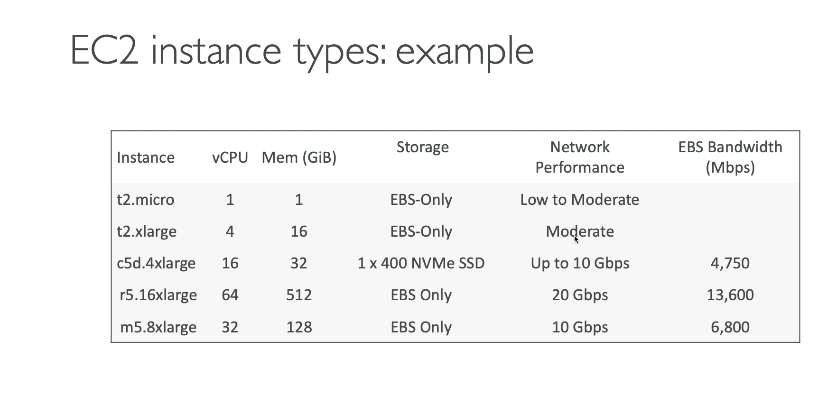
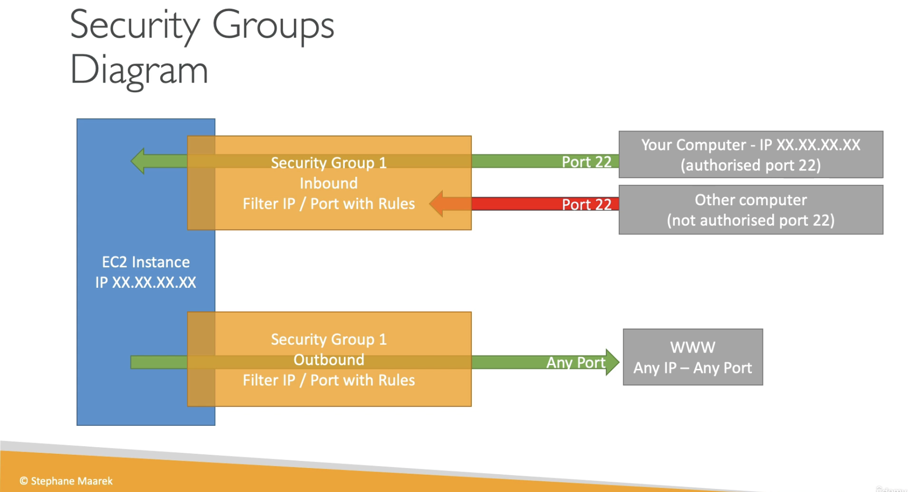
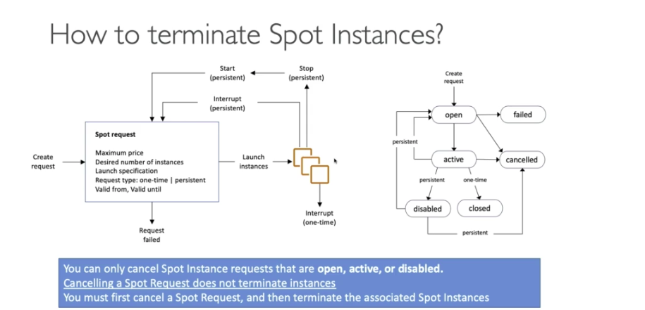

## **AWS Solutions Architect Notes - EC2_Fundamentals**

**EC2**

- What is EC2?
  - EC2 is one of the most popular of AWS's offering
  - EC2: Elastic Compute Cloud = Infrastructure as a Service
  - Consisting of:
    - Renting virtual machines (EC2)
    - Storing data on virtual drives (EBS)
    - Distributing load across machines (ELB)
    - Scaling the services using an auto-scaling group (ASG)

**EC2 sizing & configuration options** 

- Operating System (OS): Linux, Windows or Mac OS
  - How much compute power & cores (CPU)
  - How much random-access memory (RAM)
  - How much storage space: 
    - Network-attached (EBS & EFS)
    - hardware (EC2 Instance Store)
  - Network card: speed of the card Public IP address
  - Firewall rules: security group
  - Bootstrap script (configure at first launch):EC2 User Data

**EC2 User Data**

- Bootstrapping means launching commands when a machine starts
- That script is only run once at the instance first start
- EC2 user data is used to automate boot tasks such as:
  - Installing updates 
  - Installing software
  - Downloading common files from the internet
- The EC2 User Data Script runs with the root user

**EC2 Instance Types**

- Types
  - General Purpose
  - Compute Optimized
  - Memory Optimized
  - Accelerated Computing
  - Storage Optimized
  - Instance Features
  - Measuring Instance Performance

**AWS naming convention**

- m5.2xlarge
  - m: instance class
  - 5: generation (AWS improves them over time)
  - 2xlarge: size within the instance class

**EC2 Instance Types - General Purpose**

- Great for a diversity of workloads such as web servers or code repositories
- Balance between:
  - Compute
  - Memory
  - Networking

**EC2 Instance Types - Compute Optimized**

- Great for compute-intensive tasks that require high performance processors:
  - Batch processing workloads
  - Media transcoding
  - High performance web servers
  - High performance computing (HPC)
  - Scientific modeling & machine learning
  - Dedicated gaming servers
  - C series instance class

**EC2 Instance Types - Memory Optimized**

- Fast performance for workloads that process large data sets in memory
- Use cases:
  - High performance, relation/non-relation databases
  - Distributed web scale cache stores
  - In-memory databases optimized for BI (business intelligence)
  - Applications performing real-time processing of big unstructured data
  - R series instance class; Also X, High Memory and z instance classes

**EC2 Instance Types - Storage Optimized**

- Great for storage-intensive tasks that require high, sequential read and write access
  to large data sets on local storage
- Use cases:
  - High frequency online transaction processing (OLTP) systems
  - Relational & NoSQL databases
  - Cache for in-memory databases (Redis)
  - Data warehousing applications
  - Distributed file systems

**Security Groups**

- Security Groups are the fundamental of network security in AWS
- They control how traffic is allowed into or out of our EC2 instances.
- Security groups only contain **_allow_** rules
- Security groups rules can reference by IP or by security group
- Security groups are acting as a "firewall" on EC2 instances
- They regulate:
  - Access to Ports
  - Authorised IP ranges IPv4 and IPv6
  - Control of inbound network (from other to the instance)
  - Control of outbound network (from the instance to other)

**Security Groups - Good to know**

- Can be attached to multiple instances
- Locked down to a region/VPC combination
- Does live "outside" the EC2 - if traffic is blocked the EC2 instance won't see
- It's good to maintain one separate security group for SSH access
- If your application is not accessible (time out), then it's security group issue
- If your application gives a "connection refused" error, then it's an application error or it's not launced
- All inbound traffic is **blocked** by default
- All outbound traffic is **authorized** by default

**Classic Ports to know**

- 22 = SSH(Secure Shell) - log into a Linux instance
- 21 = FTP (File Transfer Protocol) - upload files into a file share
- 22 = SFTP (Secure File Transfer Protocol)
- 80 = HTTP - access unsecured websites
- 443 = HTTPS - access secured websites
- 3389 = RDP (Remote Desktop Protocol) - log into a Windows instance

**EC2 Instances Purchasing Options**

- On-Demand Instances: short workload, predictable pricing
- Reserved: (Minimum 1 Year)
  - Reserved Instances: long workloads
  - Convertible Reserved Instances: long workloads with flexible instances
  - Scheduled Reserved Instances: examples - every Thursday between 3 and 6 pm 
- Spot Instances: short workloads, cheap, can lose instances (less reliable)
- Dedicated Hosts: book an entire physical server, control instance placement

**EC2 On Demand**

- Pay for what you use:
  - Linux or Windows - billing per second, after the first minute
  - All other operating systems - billing per hour 
- Has the highest cost but no upfront payment 
- No long-term commitment
- Recommended for short-term and un-interrupted workloads, where you can't predict how the application will behave.

**EC2 Reserved Instances**

- Up to 75% discount compared to On-demand
- Reservation period: 1 year = + discount | 3 years = ++ discount 
- Purchasing options: no upfront | partial upfront = + | All upfront == ++ discount
- Reserve a specific instance type 
- Recommended for steady-state usage applications (think database)

- Convertible Reserved Instance
  - can change the EC2 instance type
  - up to 54% discount 
- Scheduled Reserved Instances
  - launch within time window you reserve
  - When you require a fraction of day / week / month
  - Still commitment over 1 to 3 years 

**EC2 Spot Instances**

- Can get a discount of up to 90% compared to On-demand
- Instances that you can "lose" at any point of time if your max price is less than the current spot price.
- The MOST cost-efficient instances in AWS

- Useful for workloads that are resilient to failure
  - Batch jobs
  - Data analysis
  - Image processing 
  - Any distributed workloads
  - Workloads with a flexible start and end time

- Define max spot price and get the instance while current spot price < max
  - The hourly spot price varies based on offer and capacity
  - If the current spot price > your max price you can choose to stop or terminate your instance wit ha 2 minutes grace period.
- Other strategy: **Spot Block**
  - "block" spot instance during a specified time frame (1 to 6 hours) without interruptions 
  - In rare situations, the instance may be reclaimed

- Not suitable for critical jobs or databases

**EC2 Dedicated Hosts**

- An Amazon EC2 Dedicated Host is a physical server with EC2 instance capacity fully dedicated to your use.
  Dedicated Hosts can help you address compliance requirements and reduce costs by allowing you to user your existing 
  server-bound software licenses. 
- Allocated for your account for a 3-year period reservation
- More expensive 

- Useful for software that have complicated licensing model (BYOL - Bring Your Own License)
- Or for companies that have strong regulatory or compliance needs

**EC2 Dedicated Instances**

- Instances running on Hardware that's dedicated to you
- May share hardware with other instances in same account
- No control over instance placement (can move hardware after Stop/Start)

**Spot Fleets**

- Spot Fleets = set of Spot Instances + (optional) On-Demand Instances
- The Spot Fleet will try to meet hte target capacity with price constraints
  - Define possible launch pools: instance type (m5.large), OS,Availability Zone
  - Can have multiple launch pools, so that the fleet can choose
  - Spot fleet stops launching instances when reaching capacity or max cost
- Strategies to allocate Spot Instances:
  - lowestPrice: from the pool with the lowest price (cost optimization, short workload)
  - diversified: distributed across all pools (great for availability, long workloads)
  - capacityOptimized: pool with the optimal capacity for the number of instances

- Spot Fleets allow us to automatically request Spot Instances with the lowest price

### **Questions**

**Which EC2 Purchasing Option can provide you the biggest discount, but it is not suitable for critical jobs or databases?**

- Spot Instances
  - Spot Instances are good for short workloads and this is the cheapest EC2 Purchasing Option. But, they are less
    reliable because you can lose your EC2 instance. 

**What should you use to control traffic in and out of EC2 instances?**
- Security Groups
  - Security Groups operate at the EC2 instance level and can control traffic.

**How long can you reserve an EC2 Reserved Instance?**
- 1 or 3 years
  - ONLY 1 or 3 years

**You would like to deploy a High-Performance Computing (HPC) application on EC2 instances. Which EC2 instance type should you choose?**
- Compute Optimized
  - Compute Optimized EC2 instances are great for compute-intensive workloads requiring high-performance processors
    (e.g., batch processing, media transcoding, high-performance computing, scientific modeling; machine learning, and dedicated gaming servers).

**Which EC2 Purchasing Option should you use for an application you plan to run on a server continuously for 1 year?**
- Reserved Instances
  - Reserved Instances are good for long workloads. You can reserve EC2 instances for 1 or 3 years. 

**You are preparing to launch an application that will be hosted on a set of EC2 instances. 
This application needs some software installation and some OS packages need to be updated during the first launch. 
What is the best way to achieve this when you launch the EC2 instances?**
- Write a bash script that installs the required software and updates to your OS, then use this script in EC2 User Data when you launch
  your EC2 instances.
  - EC2 User Data is used to bootstrap your EC2 instances using a bash script. This script can contain commands such as 
    installing software/packages, download files from the Internet, or anything you want.

**Which EC2 Instance Type should you choose for a critical application that uses an in-memory database?**
- Memory Optimized
  - Memory Optimized EC2 instances are great for workloads requiring large data sets in memory.

**You have an e-commerce application with an OLTP database hosted on-premises. This application has popularity which results in its database has thousands of requests per second. You want to migrate the database to an EC2 instance. Which EC2 Instance Type should you choose to handle this high-frequency OLTP database?**
- Storage Optimized
  - Storage Optimized EC2 instances are great for workloads requiring high, sequential read/write access to large data sets on local storage.

**Security Groups can be attached to only one EC2 instance.**
- False
  - Security Groups can be attached to multiple EC2 instances within the same AWS Region/VPC

**You're planning to migrate on-premises applications to AWS. Your company has strict compliance requirements that require your applications to run on dedicated servers. You also need to use your own server-bound software license to reduce costs. Which EC2 Purchasing Option is suitable for you?**
- Dedicated Hosts
  - Dedicated Hosts are good for companies with strong compliance needs or for software that have complicated licensing models. This is the most expensive EC2 Purchasing Option available.

**You would like to deploy a database technology on an EC2 instance and the vendor license bills you based on the physical cores and underlying network socket visibility. Which EC2 Purchasing Option allows you to get visibility into them?**
- Dedicated Hosts